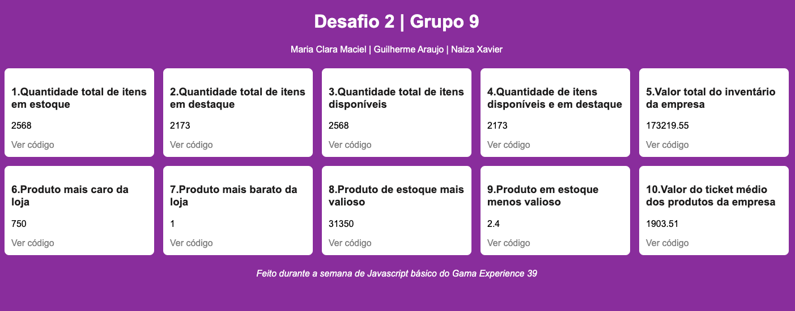

<h2 align="center"> Desafio 2 | Grupo 9 </h2>
<p align="center">Maria Clara Maciel | Guilherme Araujo | Naiza Xavier </p>

<p align="center">
  
</p>

<p> Você pode verificar as respostas direto na pasta de soluções com NodeJs, comandos logo abaixo, ou aqui <a href="https://desafio2-grupo9.netlify.app/">nesse link.</a> 


---
### 💻 Como rodar as respostas:

```
1. cd solucoes (entrar na pasta)
```
```
2. node exec1.js (rodar arquivo com o node para ver resposta no terminal)
```

### 🚀 Tecnologias

Esse projeto foi desenvolvido com as seguintes tecnologias:

- JavaScript
- HTML
- CSS

### 💻 Desafio

Contexto:

- Somos parte de uma equipe de desenvolvimento de websites e fomos contratados para a criação de um site de catálogo de produtos. Agora precisamos definir algumas regras de negócio para nosso Comércio Eletrônico e para isso precisamos definir algumas funcionalidades que podemos trabalhar usando Lógica de Programação e Javascript.
---
Itens a serem resolvidos:

1. Quantidade total de itens em estoque (somatória das quantidades de todos os produtos)<

2. Quantidade total de itens em destaque (somatória das quantidades dos itens marcados como "emDestaque : sim")

3. Quantidade total de itens disponíveis (similar ao anterior)

4. Quantidade de itens disponíveis e em destaque

5. Valor total do inventário da empresa (somatória dos valores individuais multiplicado pela quantidade em estoque - considere apenas os produtos “EM ESTOQUE”)

6. Produto mais caro da loja (bem como seu departamento - considere apenas o preço dele)

7. Produto mais barato da loja (bem como seu departamento - considere apenas o preço dele)

8. Produto de estoque mais valioso (considere o preço multiplicado pela quantidade e também apenas EM ESTOQUE)

9. Produto em estoque menos valioso (considere o preço multiplicado pela quantidade e também apenas EM ESTOQUE)

10. Valor do ticket médio dos produtos da empresa (basicamente o valor total do inventário dividido pelo número de itens - considere TODOS os produtos, porém considere apenas 1 exemplar por produto)

11. Somatória de itens por departamento (você deverá retornar um objeto contendo o nome do departamento e o total de itens nele - Novamente considere os produtos “EM ESTOQUE” - e é apenas a somatória da quantidade de itens)

12. Valor total do inventário por departamento (similar ao item anterior - considere TODOS os produtos)

13. Ticket médio por departamento (similar ao item anterior, porém retornando uma lista de objetos que contenha o nome do departamento e o seu ticket médio). Este é um exercícios difícil, porém é descomplicado de ser realizado tendo claro as demais saídas até então. Verifique a possibilidade de reutilizar parte da programação ou sua lógica trabalhada.

14. Departamento mais valioso (qual o departamento que tem a maior somatória dos valores dos itens - Considere todos os departamentos)

15. Departamento menos valioso (similar ao anterior)


